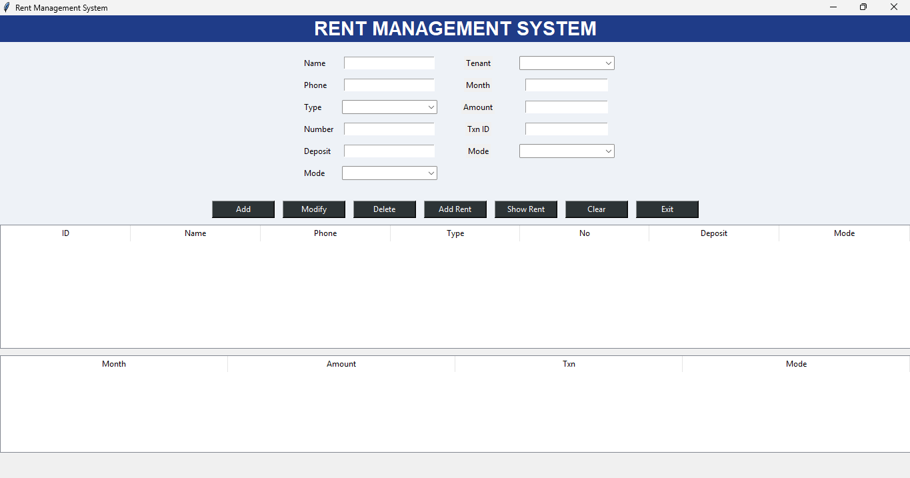
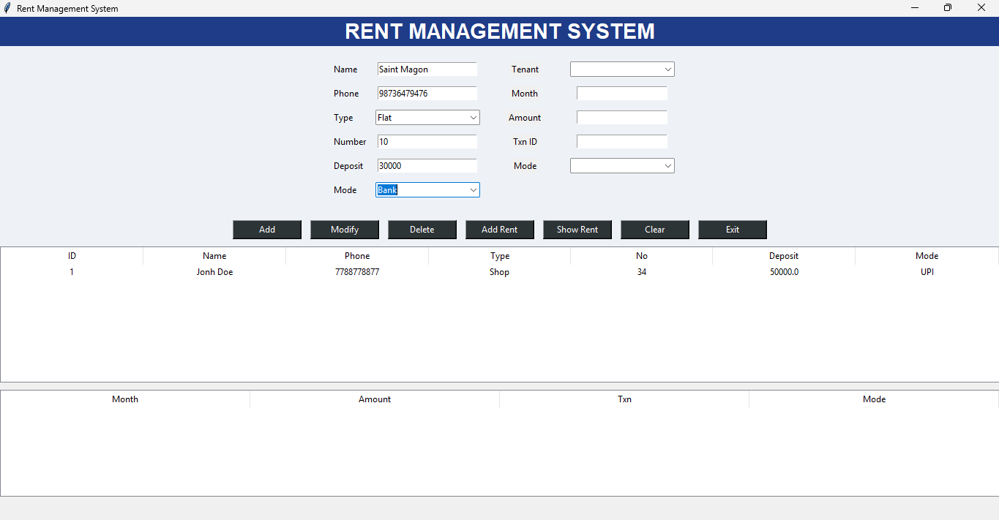
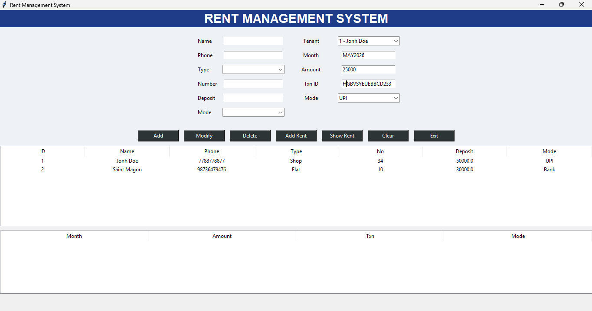
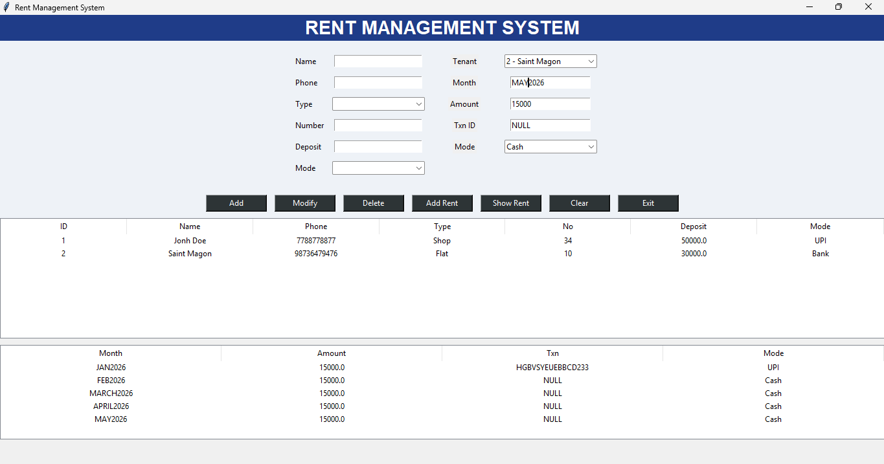

# Rent Management System

A desktop-based Rent Management System developed in Python using Tkinter for the GUI, SQLite for data storage, and Flask for API integration.

## Features

### Tenant Management
- Add new tenants
- Modify tenant details
- Delete tenant records
- View all tenants

### Rent Management
- Record rent payments
- Store transaction IDs
- Support multiple payment modes:
  - Cash
  - UPI
  - Bank Transfer
  - Cheque

### Dashboard API
Provides summary information:
- Total tenants
- Total properties
- Total rent collected
- Pending rent estimation

### REST API Endpoints

#### Get Tenants

```http
GET /get_tenants
```

Example Response:

```json
[
  {
    "id": 1,
    "name": "John Doe"
  }
]
```

#### Add Rent

```http
POST /add_rent
```

Request Body:

```json
{
  "tenant_id": 1,
  "month": "May 2026",
  "amount": 12000,
  "txn": "TXN12345",
  "mode": "UPI"
}
```

#### Dashboard Summary

```http
GET /dashboard_summary
```

Example Response:

```json
{
  "collected": 50000,
  "pending": 10000,
  "tenants": 5,
  "properties": 5
}
```

## Technologies Used

- Python 3
- Tkinter
- SQLite3
- Flask
- Threading

## Installation

### Clone Repository

```bash
git clone https://github.com/yourusername/Rent-Management-System.git
cd Rent-Management-System
```

### Install Dependencies

```bash
pip install -r requirements.txt
```

### Run Application

```bash
python RENT_MANAGEMENT.py
```

## Database

The application automatically creates:

```text
rent_management.db
```

with the following tables:

- tenants
- rent

## Project Structure

```text
Rent-Management-System/
│
├── RENT_MANAGEMENT.py
├── requirements.txt
├── README.md
├── rent_management.db
└── screenshots/
```

## Future Enhancements

- User Login & Authentication
- PDF Receipt Generation
- Excel Report Export
- SMS Notifications
- Email Notifications
- Cloud Database Support
- Multi-user Access

## License

This project is open-source and available under the MIT License.
## Screenshots

### Screenshot 1


### Screenshot 2


### Screenshot 3


### Screenshot 4

